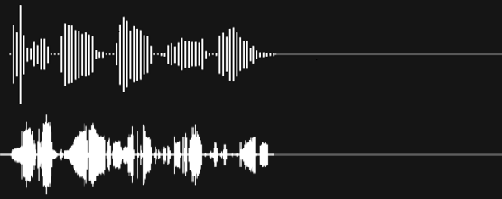

# react-voice-visualizer [Demo App](https://react-voice-visualizer.vercel.app/)

## Overview

The `react-voice-visualizer` library offers a comprehensive and highly customizable solution for capturing, visualizing, and manipulating audio recordings within your web applications. Built with React hook and component, this library simplifies the process of integrating audio recording and visualization functionalities using the [Web Audio API](https://developer.mozilla.org/en-US/docs/Web/API/Web_Audio_API).



Experience the [Demo App: Click here to explore the react-voice-visualizer](https://react-voice-visualizer.vercel.app/). Try it out and see it in action!

### Key Features:

- **Audio Recording**: Easily capture audio recordings with minimal setup using React hook and component.

- **Visualization**: Visualize audio data in real-time, making it suitable for applications such as voice recognition, sound analysis, and more.

- **Customization**: The library is absolutely customizable, allowing you to tailor the audio recording and visualization components to fit your project's unique requirements.

- **Responsiveness**: Create audio applications that adapt seamlessly to various screen sizes and devices, ensuring a consistent user experience across platforms.

This README provides a comprehensive guide to effectively utilizing the library's features.

## Installation

To integrate the React Voice Visualizer library into your project, simply install it via npm or yarn:

```bash
npm install react-voice-visualizer
```

or

```bash
yarn add react-voice-visualizer
```

## [Demo App](https://react-voice-visualizer.vercel.app/)
For a live demonstration of the React Voice Visualizer library, you can check out the [Demo Voice Visualizer App](https://react-voice-visualizer.vercel.app/). This app showcases various features and functionalities of the library in action.

Feel free to explore the demo app to see how the **React Voice Visualizer** can be used in different scenarios. You can refer to the source code of the demo app for additional examples and inspiration for using the library effectively.

## Usage

To start using the VoiceVisualizer component, you will need to import the necessary hook and component from the library.
Here's an example of how to use this library in your `App` component:

```typescript jsx
import { useEffect } from "react";
import { useVoiceVisualizer, VoiceVisualizer } from "react-voice-visualizer";

const App = () => {
    // Initialize the recorder controls using the hook
    const recorderControls = useVoiceVisualizer();
    const {
        // ... (Extracted controls and states, if necessary)
        recordedBlob,
        error,
        audioRef,
    } = recorderControls;

    // Get the recorded audio blob
    useEffect(() => {
        if (!recordedBlob) return;

        console.log(recordedBlob);
    }, [recordedBlob, error]);

    // Get the error when it occurs
    useEffect(() => {
        if (!error) return;

        console.error(error);
    }, [error]);

    return (
        <VoiceVisualizer ref={audioRef} controls={recorderControls} />
    );
};

export default App;
```

## Getting started

1. Import the required components and hooks from the library.
2. Initialize the recorder controls using the `useVoiceVisualizer` hook.
3. Use the provided state and functions to manage audio recording and playback.
4. Render the `VoiceVisualizer` component to display the real-time audio visualization.
5. Use the provided buttons to start, pause, stop, and save the audio recording.

Remember to include necessary CSS styles to customize the components and buttons according to your design preferences.

## API Reference

### `useVoiceVisualizer()` Hook

A hook that provides recorder controls and state for audio visualization.

##### Usage

```jsx
const recorderControls = useVoiceVisualizer();
```

##### Parameters (All parameters are optional)

| Parameter                | Type                     | Description                                                                                                                                               |
|:-------------------------|:-------------------------|:----------------------------------------------------------------------------------------------------------------------------------------------------------|
| `onStartRecording`       | `() => void`             | Callback function triggered when recording starts.                                                                                                        |
| `onStopRecording`        | `() => void`             | Callback function triggered when recording stops.                                                                                                         |
| `onPausedRecording`      | `() => void`             | Callback function triggered when recording is paused.                                                                                                     |
| `onResumedRecording`     | `() => void`             | Callback function triggered when recording is resumed.                                                                                                    |
| `onClearCanvas`          | `() => void`             | Callback function triggered when the canvas is cleared.                                                                                                   |
| `onEndAudioPlayback`     | `() => void`             | Callback function triggered when audio playback ends.                                                                                                     |
| `onStartAudioPlayback`   | `() => void`             | Callback function triggered when audio playback starts.                                                                                                   |
| `onPausedAudioPlayback`  | `() => void`             | Callback function triggered when audio playback is paused.                                                                                                |
| `onResumedAudioPlayback` | `() => void`             | Callback function triggered when audio playback is resumed.                                                                                               |
| `onErrorPlayingAudio`    | `(error: Error) => void` | Callback function is invoked when an error occurs during the execution of `audio.play()`. It provides an opportunity to handle and respond to such error. |

##### Returns

| Returns                             | Type                                                   | Description                                                                                                                                                                                                                                                                                                                                                                                                                                                                                                                                         |
|:------------------------------------|:-------------------------------------------------------|:----------------------------------------------------------------------------------------------------------------------------------------------------------------------------------------------------------------------------------------------------------------------------------------------------------------------------------------------------------------------------------------------------------------------------------------------------------------------------------------------------------------------------------------------------|
| `audioRef`                          | `MutableRefObject`<br/>`<HTMLAudioElement \| null>`    | Reference to the audio element used for playback.                                                                                                                                                                                                                                                                                                                                                                                                                                                                                                   |
| `isRecordingInProgress`             | `boolean`                                              | Indicates if audio recording is currently in progress.                                                                                                                                                                                                                                                                                                                                                                                                                                                                                              |
| `isPausedRecording`                 | `boolean`                                              | Indicates if audio recording is currently paused.                                                                                                                                                                                                                                                                                                                                                                                                                                                                                                   |
| `audioData`                         | `Uint8Array`                                           | Audio data for real-time visualization.                                                                                                                                                                                                                                                                                                                                                                                                                                                                                                             |
| `recordingTime`                     | `number`                                               | Elapsed time during recording in milliseconds.                                                                                                                                                                                                                                                                                                                                                                                                                                                                                                      |
| `mediaRecorder`                     | `MediaRecorder \| null`                                | MediaRecorder instance used for recording audio.                                                                                                                                                                                                                                                                                                                                                                                                                                                                                                    |
| `duration`                          | `number`                                               | Duration of the recorded audio in seconds.                                                                                                                                                                                                                                                                                                                                                                                                                                                                                                          |
| `currentAudioTime`                  | `number`                                               | Current playback time of the recorded audio in seconds.                                                                                                                                                                                                                                                                                                                                                                                                                                                                                             |
| `audioSrc`                          | `string`                                               | Source URL of the recorded audio file for playback.                                                                                                                                                                                                                                                                                                                                                                                                                                                                                                 |
| `isPausedRecordedAudio`             | `boolean`                                              | Indicates if recorded audio playback is paused.                                                                                                                                                                                                                                                                                                                                                                                                                                                                                                     |
| `isProcessingRecordedAudio`         | `boolean`                                              | Indicates if the recorded audio is being processed and 'Processing Audio...' text shown.                                                                                                                                                                                                                                                                                                                                                                                                                                                            |
| `isCleared`                         | `boolean`                                              | Indicates if the canvas has been cleared.                                                                                                                                                                                                                                                                                                                                                                                                                                                                                                           |
| `isAvailableRecordedAudio`          | `boolean`                                              | Indicates whether recorded audi is available and not currently being processed. This return value can be used to check if it's an appropriate time to work with recorded audio data in your application.                                                                                                                                                                                                                                                                                                                                            |
| `recordedBlob`                      | `Blob \| null`                                         | Recorded audio data in Blob format.                                                                                                                                                                                                                                                                                                                                                                                                                                                                                                                 |
| `bufferFromRecordedBlob`            | `AudioBuffer \| null`                                  | Audio buffer from the recorded Blob.                                                                                                                                                                                                                                                                                                                                                                                                                                                                                                                |
| `formattedDuration`                 | `string`                                               | Formatted duration time in format 09:51m.                                                                                                                                                                                                                                                                                                                                                                                                                                                                                                           |
| `formattedRecordingTime`            | `string`                                               | Formatted recording current time in format 09:51.                                                                                                                                                                                                                                                                                                                                                                                                                                                                                                   |
| `formattedRecordedAudioCurrentTime` | `string`                                               | Formatted recorded audio current time in format 09:51:1.                                                                                                                                                                                                                                                                                                                                                                                                                                                                                            |
| `startRecording`                    | `() => void`                                           | Function to start audio recording.                                                                                                                                                                                                                                                                                                                                                                                                                                                                                                                  |
| `togglePauseResume`                 | `() => void`                                           | Function to toggle pause/resume during recording and playback of recorded audio.                                                                                                                                                                                                                                                                                                                                                                                                                                                                    |
| `stopRecording`                     | `() => void`                                           | Function to stop audio recording.                                                                                                                                                                                                                                                                                                                                                                                                                                                                                                                   |
| `saveAudioFile`                     | `() => void`                                           | This function allows you to save the recorded audio as a `webm` file format. Please note that it supports saving audio only in the webm format. If you need to save the audio in a different format, you can use external libraries like `FFmpeg` to convert the Blob to your desired format. This flexibility allows you to tailor the output format according to your specific needs.                                                                                                                                                             |
| `clearCanvas`                       | `() => void`                                           | Function to clear the visualization canvas.                                                                                                                                                                                                                                                                                                                                                                                                                                                                                                         |
| `setCurrentAudioTime`               | `Dispatch<SetStateAction<number>>`                     | Internal function to handle current audio time updates during playback.                                                                                                                                                                                                                                                                                                                                                                                                                                                                             |
| `error`                             | `Error \| null`                                        | Error object if any error occurred during recording or playback.                                                                                                                                                                                                                                                                                                                                                                                                                                                                                    |
| `isProcessingOnResize`               | `boolean`                                              | Indicates whether audio processing is occurring during a resize event when audio is recorded and a blob is present.                                                                                                                                                                                                                                                                                                                                                                                                                                 |
| `isProcessingStartRecording`               | `boolean`                                              | When set to `true`, it indicates that the start recording button has been pressed, but either the permission to record has not yet been granted or the recording itself has not yet commenced. This prop serves as a helpful flag to manage the state of the recording process, allowing components to react accordingly to the current stage of recording initiation.                                                                                                                                                                              |
| `_setIsProcessingAudioOnComplete`   | `Dispatch<SetStateAction<boolean>>`                    | Internal function to set `isProcessingAudioOnComplete` state.                                                                                                                                                                                                                                                                                                                                                                                                                                                                                       |
| `_setIsProcessingOnResize`          | `Dispatch<SetStateAction<boolean>>`                    | Internal function to set `isProcessingOnResize` state.                                                                                                                                                                                                                                                                                                                                                                                                                                                                                              |

### `VoiceVisualizer` Component

A component that visualizes the real-time audio wave during recording.

### Props for AudioVisualizer Component

| Props                                             | Description                                                                                                                                                                                                                                                                     | Default       | Type                         |
|:--------------------------------------------------|:--------------------------------------------------------------------------------------------------------------------------------------------------------------------------------------------------------------------------------------------------------------------------------|:--------------|:-----------------------------|
| **`ref`**                                         | A reference to the audio element - `audioRef` from the `useVoiceVisualizer` hook.                                                                                                                                                                                               | -             | `React.RefObject` (Required) |
| **`controls`**                                    | Provides the audio recording controls and states required for visualization.                                                                                                                                                                                                    | -             | `Controls` (Required)        |
| **`height`**                                      | The height of the visualization canvas.                                                                                                                                                                                                                                         | `200`         | `string \| number` (Optional)          |
| **`width`**                                       | The width of the visualization canvas.                                                                                                                                                                                                                                          | `100%`        | `string \| number` (Optional) |
| **`backgroundColor`**                             | The background color of the visualization canvas.                                                                                                                                                                                                                               | `transparent` | `string` (Optional)          |
| **`mainBarColor`**                                | The color of the main audio wave line.                                                                                                                                                                                                                                          | `#FFFFFF`     | `string` (Optional)          |
| **`secondaryBarColor`**                           | The secondary color of the audio wave line.                                                                                                                                                                                                                                     | `#5e5e5e`     | `string` (Optional)          |
| **`speed`**                                       | The speed of the audio visualization animation (Integer from 1 to 6, higher number is slower).                                                                                                                                                                                  | `3`           | `number` (Optional)          |
| **`barWidth`**                                    | The width of each audio wave bar.                                                                                                                                                                                                                                               | `2`           | `number` (Optional)          |
| **`gap`**                                         | The gap between each audio wave bar.                                                                                                                                                                                                                                            | `1`           | `number` (Optional)          |
| **`rounded`**                                     | The border radius of the audio wave bars.                                                                                                                                                                                                                                       | `5`           | `number` (Optional)          |
| **`isControlPanelShown`**                         | Whether to display the audio control panel, including features such as recorded audio duration, current recording time, and control buttons. If you want to create your own UI, set it to false and utilize functions from the useVoiceVisualizer hook to manage audio control. | `true`         | `boolean` (Optional)         |
| **`isDownloadAudioButtonShown`**                  | Whether to display the Download audio button.                                                                                                                                                                                                                                   | `false`       | `boolean` (Optional)         |
| **`fullscreen`**                                  | Whether the visualization should be displayed in fullscreen mode. It begins from the center by default.                                                                                                                                                                         | `false`       | `boolean` (Optional)         |
| **`animateCurrentPick`**                          | Whether to animate the current pick in the visualization.                                                                                                                                                                                                                       | `true`        | `boolean` (Optional)         |
| **`onlyRecording`**                               | Whether to show the visualization only during voice recording.                                                                                                                                                                                                                  | `false`       | `boolean` (Optional)         |
| **`isDefaultUIShown`**                            | Whether to show a default UI on Canvas before recording. If you want to create your own UI, set it to false.                                                                                                                                                                    | `true`        | `boolean` (Optional)         |
| **`mainContainerClassName`**                    | The CSS class name for the main container.                                                                                                                                                                                                          | -             | `string` (Optional)          |
| **`canvasContainerClassName`**                    | The CSS class name for the container of the visualization canvas.                                                                                                                                                                                                               | -             | `string` (Optional)          |
| **`isProgressIndicatorShown`**                    | Whether to show the progress indicator after recording.                                                                                                                                                                                                                         | `true`        | `boolean` (Optional)         |
| **`progressIndicatorClassName`**                  | The CSS class name for the progress indicator.                                                                                                                                                                                                                                  | -             | `string` (Optional)          |
| **`isProgressIndicatorTimeShown`**                | Whether to show the progress indicator time.                                                                                                                                                                                                                                    | `true`        | `boolean` (Optional)         |
| **`progressIndicatorTimeClassName`**              | The CSS class name for the progress indicator with time.                                                                                                                                                                                                                        | -             | `string` (Optional)          |
| **`isProgressIndicatorOnHoverShown`**             | Whether to show the progress indicator on hover.                                                                                                                                                                                                                                | `true`        | `boolean` (Optional)         |
| **`progressIndicatorOnHoverClassName`**           | The CSS class name for the progress indicator on hover.                                                                                                                                                                                                                         | -             | `string` (Optional)          |
| **`isProgressIndicatorTimeOnHoverShown`**         | Whether to show the progress indicator time on hover.                                                                                                                                                                                                                           | `true`        | `boolean` (Optional)         |
| **`progressIndicatorTimeOnHoverClassName`**       | The CSS class name for the progress indicator with time on hover.                                                                                                                                                                                                               | -             | `string` (Optional)          |
| **`isAudioProcessingTextShown`**                  | Whether to show the audio processing text.                                                                                                                                                                                                                                      | `true`        | `boolean` (Optional)         |
| **`audioProcessingTextClassName`**                | The CSS class name for the audio processing text.                                                                                                                                                                                                                               | -             | `string` (Optional)          |
| **`controlButtonsClassName`**                     | The CSS class name for the Clear Button and Download Audio button components.                                                                                                                                                                                                   | -             | `string` (Optional)          |


## License

This library is distributed under the MIT License.

## Issues

If you encounter any bugs or have suggestions for improvements, please report them in the GitHub Issues section.

## Support

For support or general questions, you can reach out to [zarytskyi222@gmail.com](mailto:zarytskyi222@gmail.com).

If you find my project valuable and would like to support its development, you can buy me a coffee ☕. Your contribution helps keep this project active and growing.

<a href="https://www.buymeacoffee.com/zarytskyi22" target="_blank"></a>

Your contribution is greatly appreciated! ❤️🚀

## Credits

This library was created by [Yurii Zarytskyi](https://github.com/YZarytskyi)

  <a href="https://www.linkedin.com/in/yurii-zarytskyi/" rel="nofollow noreferrer">
     LinkedIn
  </a>
